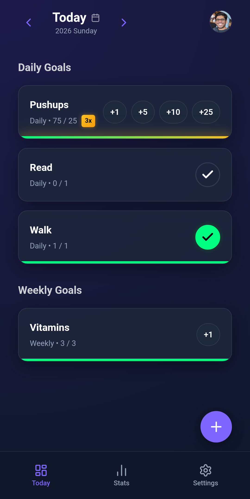
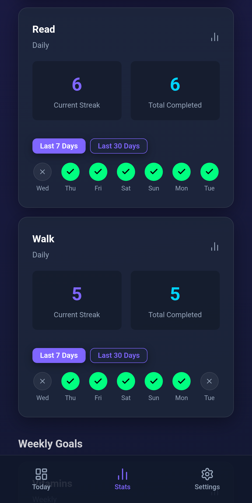
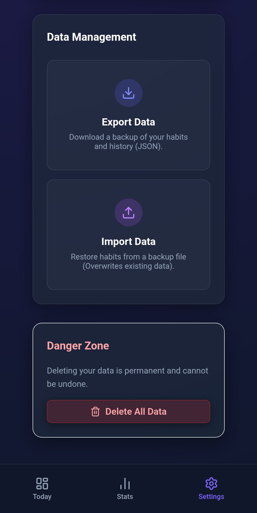
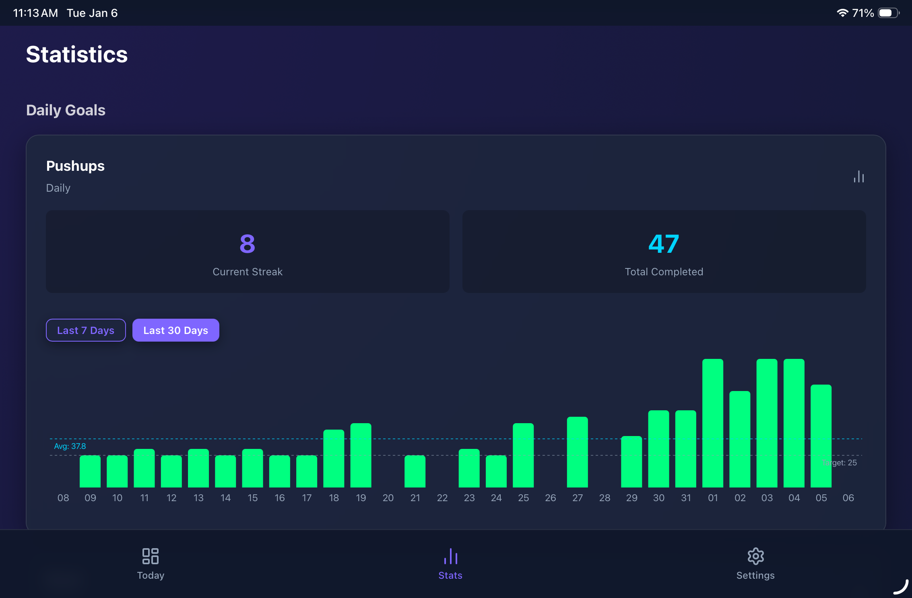

# Habit Tracker PWA

A simple Habit Tracker without ads or in-app purchases. I couldn't find one that was simple and just got out the way. So I decided to vibe-code one.

> Vibecoded using **Antigravity IDE**.


| | | | |
|:---:|:---:|:---:|:---:|
|  |  |  |  |

<br />

| |
|:---:|
|  |

## Features

-   **Smart Tracking**: Daily, Weekly, and Monthly habits with auto-reset.
-   **Flexible Goals**: Track binary completion (Done/Not Done) or specific counts (e.g., 5 cups of water).
-   **Visual Stats**: View streaks and completion progress.
-   **Offline Ready**: Works without internet connection.
-   **Clean UI**: Dark mode design with glassmorphism elements.

## Tech Stack

-   **Frontend**: React, Vite
-   **Backend**: Firebase (Firestore, Auth, Hosting)
-   **Styling**: CSS Modules
-   **Icons**: Lucide React

## Getting Started

1.  **Clone & Install**:
    ```bash
    git clone <repo-url>
    cd HabitTracker
    npm install
    ```
2.  **Run Locally**:
    ```bash
    npm run dev
    ```
    Open `http://localhost:5173`.

## Deployment & Setup

For detailed backend configuration (Security Rules, Indexes) and deployment instructions, see:
👉 [**firebase/SETUP.md**](./firebase/SETUP.md)


